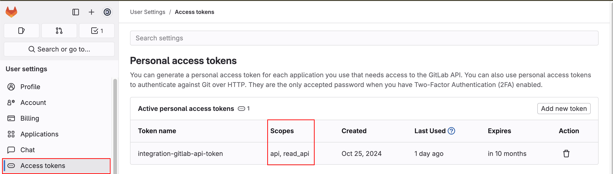
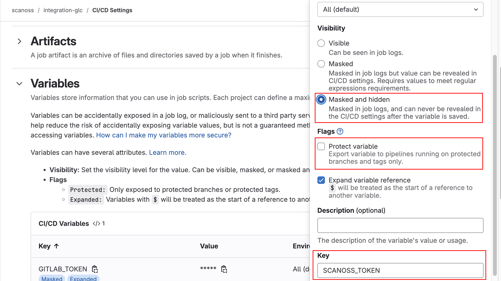

SCANOSS Gitlab Code Scan Component
==================================

Introduction
------------

This document will go through the complete process of integrating SCANOSS into your GitLab repositories.

Using the SCANOSS Gitlab Code Scan Component within your GitLab pipeline allows you to automatically identify security and license compliance issues in your code.

Gitlab configuration
--------------------

Setting up Gitlab access token
~~~~~~~~~~~~~~~~~~~~~~~~~~~~~~
1. Navigate to your GitLab organization settings
2. Go to **Preferences** > **Access Tokens**
3. Click on **Add new token**
4. Configure the token:

   - Required scopes: ``api``, ``read_api``
   - Name: Choose a descriptive name (e.g., "SCANOSS Integration")
   - Expiration: Set according to your security policies

Configuring Pipeline Variables
------------------------------
To enable the SCANOSS Gitlab Code Scan Component two variables are needed.

Required Variables
~~~~~~~~~~~~~~~~~~
- ``SCANOSS_TOKEN``
- ``GITLAB_TOKEN``

Setup Steps
~~~~~~~~~~~
1. Go to your GitLab project
2. Navigate to **Settings** > **CI/CD** > **Variables**
3. Click **Add variable**
4. Configure each token with:

   - **Visibility**: Masked and hidden
   - **Flags**: Uncheck "Protect variable"
   - **Key**: Enter token name (``SCANOSS_TOKEN`` or ``GITLAB_TOKEN``)
   - **Value**: Paste your token

.. note::
   "Masked and hidden" ensures tokens are never displayed in logs or settings after saving.

Pipeline
--------
A basic pipeline should be set and the SCANOSS task should be included within it:

.. code-block:: yaml

   include:
      - component: gitlab.com/scanoss1/glc-code-scan/scanoss@87958679dc07a32ca1e3e3105ce5b3316427c857
        inputs:
           stage: test
           api_url: https://api.scanoss.com/scan/direct
           policies: undeclared,copyleft
           dependencies_enabled: true
           rules:
              - if: $CI_PIPELINE_SOURCE == "schedule"
              - if: $CI_MERGE_REQUEST_IID
   stages: [run, test, build]

Pipeline Triggers
~~~~~~~~~~~~~~~~~
Pipeline is being triggered by merge requests.

Action Input Parameters
~~~~~~~~~~~~~~~~~~~~~~~

.. list-table::
   :header-rows: 1
   :widths: 20 50 15 15

   * - **Parameter**
     - **Description**
     - **Required**
     - **Default**
   * - sbom_enabled
     - Enable or disable scanning based on the SBOM file
     - Optional
     - ``true``
   * - sbom_file_path
     - Filepath of the SBOM file to be used for scanning
     - Optional
     - ``sbom.json``
   * - sbom_type
     - Type of SBOM operation: either 'identify' or 'ignore'
     - Optional
     - ``identify``
   * - skip_snippets
     - Skip the generation of snippets. (scan_files option must be enabled)
     - Optional
     - ``false``
   * - scan_files
     - Enable or disable file and snippet scanning
     - Optional
     - ``true``
   * - dependencies_enabled
     - Option to enable or disable scanning of dependencies
     - Optional
     - ``false``
   * - dependency_scope
     - Gets development or production dependencies (scopes: dev - prod)
     - Optional
     - -
   * - dependency_scope_include
     - Custom list of dependency scopes to be included. Provide scopes as a comma-separated list
     - Optional
     - -
   * - dependency_scope_exclude
     - Custom list of dependency scopes to be excluded. Provide scopes as a comma-separated list
     - Optional
     - -
   * - policies
     - List of policies separated by commas, options available are: copyleft, undeclared
     - Optional
     - ``copyleft,undelcared``
   * - policies_halt_on_failure
     - Halt check on policy failure. If set to false checks will not fail
     - Optional
     - ``true``
   * - api_url
     - SCANOSS API URL
     - Optional
     - ``https://api.osskb.org/scan/direct``
   * - apiKey
     - SCANOSS API Key
     - Optional
     - -
   * - runtime_container
     - Runtime URL
     - Optional
     - ``ghcr.io/scanoss/scanoss-py:v1.17.2``
   * - licenses_copyleft_include
     - List of Copyleft licenses to append to the default list. Provide licenses as a comma-separated list
     - Optional
     - -
   * - licenses_copyleft_exclude
     - List of Copyleft licenses to remove from default list. Provide licenses as a comma-separated list
     - Optional
     - -
   * - licenses_copyleft_explicit
     - Explicit list of Copyleft licenses to consider. Provide licenses as a comma-separated list
     - Optional
     - -

Policy Checks
-------------
The SCANOSS Gitlab Code Scan Component includes two configurable policies:

1. Copyleft: This policy checks if any component or code snippet is associated with a copyleft license. If such a
   license is detected, the pull request (PR) is rejected. The default list of Copyleft licenses is defined in the following `file <https://github.com/scanoss/scanoss.py/blob/main/src/scanoss/inspection/utils/license_utils.py>`_.

.. note::
  A copyleft license is a software license that allows free use and modification of code, but requires all derivative works to use the same open license. The GNU GPL is the most famous example. Unlike permissive licenses (MIT/Apache), copyleft prevents the code from being used in closed-source projects.

2. Undeclared: This policy compares the components detected in the repository against those declared in the sbom.json
   file (customizable through the sbom.filepath parameter). If there are undeclared components, the PR is rejected.

.. note::
  An undeclared open source component is software code that uses open source elements but fails to document or acknowledge them in the product's license declarations or documentation. This creates legal and compliance risks since it violates the terms of the open source licenses and can lead to licensing conflicts or intellectual property issues.

Additionally, if it is a Pull Request, a comment with a summary of the report will be automatically generated.

.. image:: /assets/undeclared-components-PR-report.png
   :alt: Comments on PR Undeclared Components

.. image:: /assets/copyleft-PR-report.png
   :alt: Comments on PR Copyleft licenses

Artifacts
---------
The scan results and policy check outcomes are uploaded to the artifacts folder of the specific run of the pipeline.

.. image:: /assets/artifacts.png
   :alt: Artifacts

Example Repository
------------------
An example use case can be found at the following `link <https://gitlab.com/scanoss1/integration-glc>`_.

